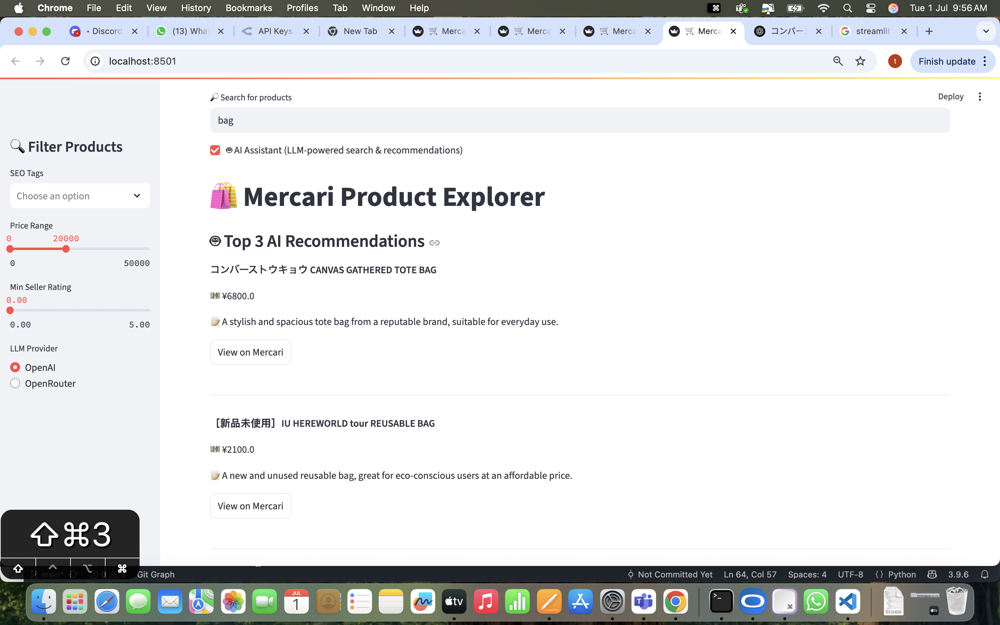
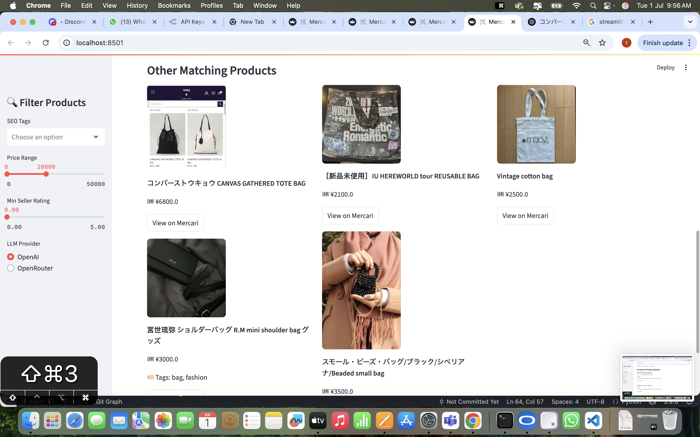

# Mercari Japan AI Shopper

## Overview
This project is a Python-based AI agent and web application for searching, scraping, and recommending products from Mercari Japan. It features a robust backend scraper, PostgreSQL integration, SEO tagging, and a modern Streamlit UI. The system is designed to:
- Understand user requests (LLM integration ready)
- Search Mercari Japan for products using diverse keywords
- Extract and store product data (name, price, image, etc.)
- Tag products with SEO metadata
- Present products in a user-friendly, filterable web UI




## Setup Instructions
1. **Clone the repository:**
   ```bash
   git clone https://github.com/ayushxx7/mercari-search-ai-agent.git
   cd mercari-search-ai-agent
   ```
2. **Install dependencies:**
   ```bash
   pip install -r requirements.txt
   ```

3. **Configure PostgreSQL:**
   - Edit `config.py` with your database credentials.
   - Ensure your PostgreSQL server is running.
4. **Run the scraper:**
   ```bash
   python scraper.py
   ```
5. **Tag products with SEO tags:**
   ```bash
   python -c "import seo_tagger; seo_tagger.tag_unprocessed_products()"
   ```
6. **Launch the Streamlit UI:**
   ```bash
   python -m streamlit run streamlit_app.py
   ```

## LLM Provider Setup

To use the AI Assistant features, you can choose between OpenAI and OpenRouter as the LLM provider. The app supports both, with a UI toggle and automatic fallback if one fails.

Set the following environment variables (e.g., in your Streamlit Cloud or local .env):

- `OPENAI_API_KEY` — Your OpenAI API key (https://platform.openai.com/)
- `OPENROUTER_API_KEY` — Your OpenRouter API key (https://openrouter.ai/)
- `OPENROUTER_BASE_URL` — (Optional, defaults to `https://openrouter.ai/api/v1`)

## Usage Instructions
- Use the web UI to search, filter, and browse products.
- The search bar supports real-time keyword search.
- Filter by category, SEO tags, price, and more.

## Usage Instructions (AI Assistant)
- Enable the "AI Assistant" checkbox in the UI to use LLM-powered search and recommendations.
- Select your preferred LLM provider (OpenAI or OpenRouter) from the sidebar.
- If the selected provider fails (e.g., quota exceeded), the app will automatically try the other provider.
- The AI Assistant supports hybrid English/Japanese queries and can match product names, tags, and descriptions across both languages, including transliterations and synonyms.
- LLM-based translation is used to improve understanding and matching of user queries and product data.

## Design Choices
- **Scraping:** Uses `mercapi` for robust, API-like scraping of Mercari Japan.
- **Database:** PostgreSQL with SQLAlchemy ORM for reliability and scalability.
- **SEO Tagging:** Rule-based tagger for product enrichment.
- **UI:** Streamlit for rapid, modern web app development.
- **Extensibility:** LLM integration (OpenAI/OpenRouter) enables natural language understanding, hybrid language search, and smart recommendations.

## Potential Improvements
- Add user authentication and favorites/cart features.
- Schedule periodic scraping and auto-tagging.
- Add more advanced analytics and product insights.
- Expand SEO tagging with LLMs for richer metadata.

## License
MIT