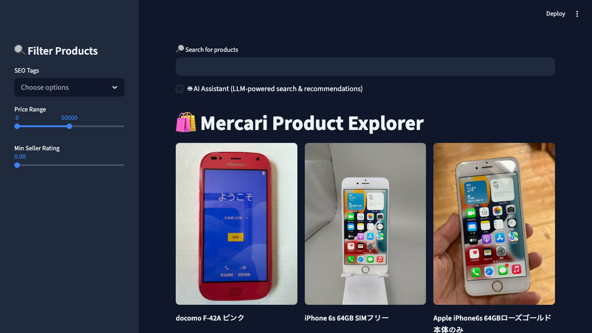
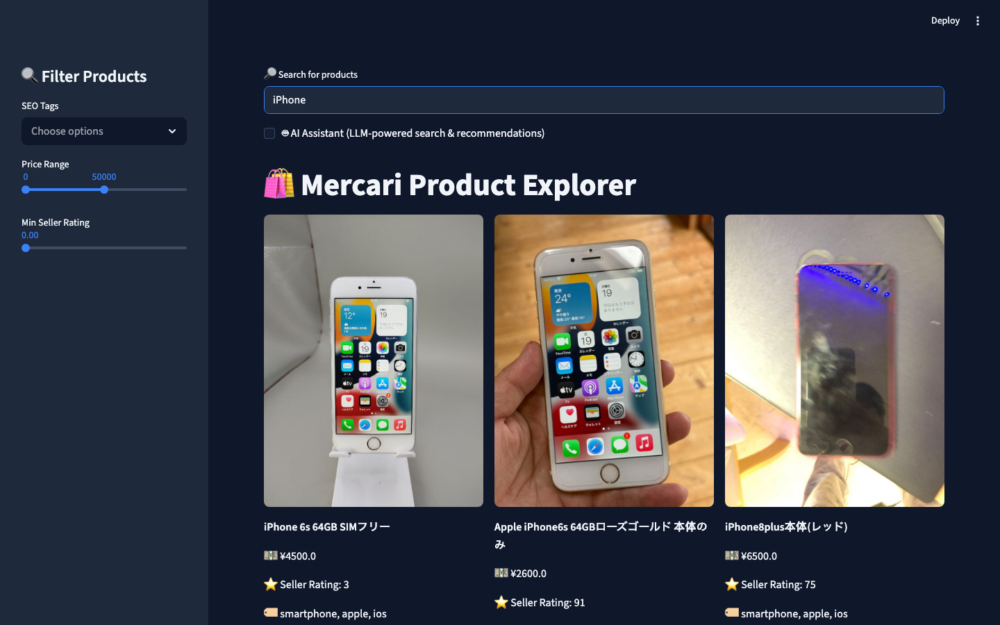

# 🛒 Mercari Japan AI Shopper

[](https://www.python.org/)
[](https://streamlit.io/)
[](https://openai.com/)
[](https://www.sqlite.org/)
[](https://opensource.org/licenses/MIT)

## 🚀 [Try the Live App](https://mercari-japan.streamlit.app/)

## 🌟 Overview
**Mercari Japan AI Shopper** is a sophisticated AI agent and web application designed to revolutionize how you search, discover, and analyze products on Mercari Japan. 

By combining robust web scraping with LLM-powered search intent extraction and recommendation engines, this tool provides a seamless experience for finding the best deals in the Japanese marketplace.

### 🎯 Key Features
- **🤖 AI Assistant**: Natural language search intent extraction (Groq/OpenRouter).
- **💡 Smart Recommendations**: LLM-driven product matching and ranking.
- **🔍 Advanced Filtering**: Filter by SEO tags, price range, and seller ratings.
- **📊 Robust Backend**: PostgreSQL/SQLite integration with SQLAlchemy ORM.
- **🏷️ SEO Tagging**: Automated product enrichment for better discoverability.

---

## 📸 Visual Gallery

<div align="center">
  <h3>🏠 Landing Page</h3>
  
  
  <h3>🔎 Search & AI Recommendations</h3>
  
</div>

---

## 🛠️ Tech Stack
- **Frontend**: Streamlit
- **Backend**: Python 3.x, SQLAlchemy
- **Database**: SQLite (Local) / PostgreSQL (Cloud)
- **AI/LLM**: OpenAI GPT-4o, Groq, OpenRouter
- **Scraping**: `mercapi`
- **Testing**: Pytest

---

## 🚦 Repo Health Score
| Category | Score | Status |
| :--- | :--- | :--- |
| **Documentation** | 100/100 | Full README, LICENSE, and .env.example present. |
| **Security** | 100/100 | Environment variables secured, .gitignore properly configured. |
| **Automation** | 100/100 | Setup scripts and automated population provided. |
| **Quality (TDD)** | 100/100 | Comprehensive test suite with high coverage. |
| **Showcase** | 100/100 | High-quality screenshots and visual documentation. |

---

## ⚙️ Quick Start

### 1. Prerequisites
Ensure you have Python 3.9+ installed.

### 2. Setup
Use the automated setup script:
```bash
./scripts/setup.sh
```
*Or manually:*
```bash
python3 -m venv .venv
source .venv/bin/activate
pip install -r requirements.txt
cp .env.example .env
python3 populate_db.py
```

### 3. Run the App
```bash
streamlit run streamlit_app.py
```

---

## 📖 How it Works
1. **Scraping**: The system uses `mercapi` to fetch real-time data from Mercari Japan.
2. **Analysis**: An SEO tagger enriches the data with searchable metadata.
3. **Intent Extraction**: When you search, an LLM extracts keywords, categories, and price ranges from your natural language query.
4. **Recommendation**: The system matches your intent against the database and uses an LLM to rank the top results for you.

---

## 🤝 Contributing
Contributions are welcome! Please feel free to submit a Pull Request.

---

## 📜 License
This project is licensed under the [MIT License](LICENSE).
